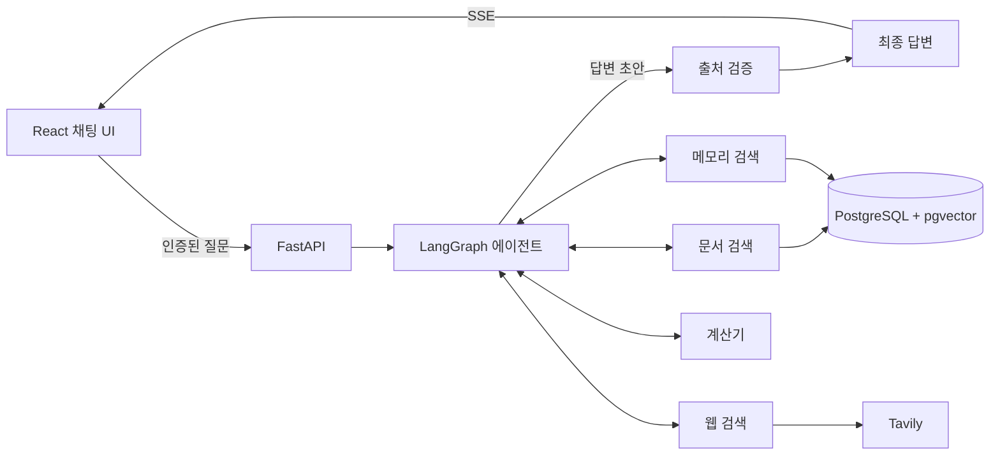

[English](README.md) | [한국어](README.ko.md)

# LangGraph Agentic RAG

업로드한 PDF, 웹 검색, 저장된 사용자 메모리를 활용해 질문에 답하는 풀스택 채팅 애플리케이션입니다. LangGraph 에이전트가 필요한 도구를 선택하고, 검색한 근거와 함께 답변을 제공합니다.

## 주요 기능

- **PDF 질의응답** — 대화당 PDF 최대 1개를 비공개 Supabase Storage에 업로드합니다. 백그라운드에서 페이지별 텍스트를 추출하고 청크로 나눈 뒤, OpenAI 임베딩을 PostgreSQL의 pgvector에 저장합니다.
- **하이브리드 검색** — 벡터 유사도 검색과 PostgreSQL Full-Text Search(FTS)를 reciprocal rank fusion으로 결합합니다. Cohere로 후보를 재정렬하고 인접 청크를 포함해 문맥을 보완합니다.
- **에이전트의 도구 선택** — 대화에 첨부된 문서 검색, Tavily 웹 검색, 사용자 메모리 검색, 산술 계산 중 필요한 도구를 사용합니다.
- **확인 가능한 답변 근거** — 본문의 인용을 열어 PDF의 인용 문단과 페이지 번호 또는 웹 발췌문과 링크를 확인합니다.
- **대화 간 메모리** — 지속적으로 유용한 사용자 정보와 선호를 자동 추출하고 의미 기반으로 검색합니다. 저장된 메모리를 조회하거나 개별·전체 삭제할 수 있습니다.
- **인증 기반 채팅 UI** — 이메일·비밀번호 회원가입과 로그인, 대화 기록 저장, 대화 제목 자동 생성, 서버 전송 이벤트(SSE)를 통한 진행 상태 표시, 라이트·다크 테마를 제공합니다.
- **관측성** — Langfuse로 에이전트 실행과 모델 호출을 추적하며, 내보내기 전에 인증 정보를 마스킹합니다.

## 동작 방식



에이전트는 필요에 따라 모델 추론과 도구 호출을 반복합니다. 문서·웹 검색 도구는 현재 실행에서 확보한 근거를 기록합니다. 검토 단계에서는 인용된 출처 ID를 확인하고, 검색을 사용한 경우 해당 근거가 답변을 뒷받침하는지 검토합니다. 실행 중에는 진행 상태를 스트리밍하고, 최종 답변은 완성된 메시지로 전달합니다.

## 기술 스택

| 영역 | 기술 |
| --- | --- |
| 프론트엔드 | React 19, TypeScript, Vite 8, React Router, Tailwind CSS 4 |
| 백엔드 | Python 3.14+, FastAPI, SQLModel, Alembic |
| 에이전트·검색 | LangGraph, LangChain, OpenAI, Cohere, Tavily, pypdf |
| 데이터 | PostgreSQL 17, pgvector, Supabase Storage |
| 인증 | Supabase Auth |
| 관측성 | Langfuse |
| 개발 도구 | Bun, uv, Ruff, Oxlint, pytest, Playwright, Docker, GitHub Actions |

## 로컬 실행

### 준비 사항

- Bun과 Docker가 필요합니다.
- OpenAI, Cohere, Tavily API 키와 Langfuse 프로젝트 인증 정보가 필요합니다.

아래 명령은 저장소 루트에서 실행합니다.

### 1. 의존성 설치 및 로컬 Supabase 설정

```bash
bun install --frozen-lockfile
[ -f .env ] || cp .env.example .env
bash scripts/start-supabase.sh
```

Supabase 상태 출력에서 다음 값을 `.env`에 입력합니다.

- `PUBLISHABLE_KEY` → `SUPABASE_PUBLISHABLE_KEY`
- `SECRET_KEY` → `SUPABASE_SECRET_KEY`

### 2. 데이터베이스 초기화

```bash
bun run db:bootstrap
```

### 3. 앱 실행

```bash
bun run backend:start
```

다른 터미널에서 저장소 루트를 기준으로 실행합니다.

```bash
bun run frontend:dev
```

[http://127.0.0.1:5173](http://127.0.0.1:5173)에서 계정을 만든 뒤 새 대화에 PDF를 업로드하거나 문서 없이 질문할 수 있습니다.

백엔드 API 문서는 [http://127.0.0.1:8000/docs](http://127.0.0.1:8000/docs)에서 확인할 수 있습니다.

## 프로젝트 구조

```text
backend/app/
  agent/          에이전트 그래프, 도구, 근거 검증, 메모리 추출
  api/            인증된 API 라우트와 SSE 전달
  rag/            PDF 인덱싱, 하이브리드 검색, 재정렬, 웹 검색
  models/         SQLModel 데이터베이스 모델
  db/             메시지, 인용, 메모리 저장 로직
  alembic/        데이터베이스 마이그레이션
  storage/        Supabase 문서 저장소
  observability/  Langfuse 추적과 인증 정보 마스킹
backend/tests/    백엔드 테스트
frontend/src/     React 페이지, 컴포넌트, API 클라이언트
frontend/tests/   Playwright 브라우저 테스트
supabase/         로컬 Auth, Storage, PostgreSQL 설정
scripts/          로컬 서비스 시작 및 데이터베이스 초기화
```
