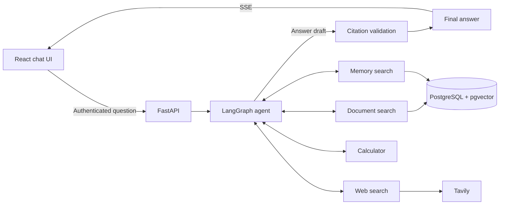

[English](README.md) | [한국어](README.ko.md)

# LangGraph Agentic RAG

A full-stack chat application that answers questions using an uploaded PDF, web search, and saved user memories. A LangGraph agent selects the tools it needs and returns answers with supporting evidence.

## Features

- **PDF question answering** — Upload up to one PDF per chat to private Supabase Storage. A background task extracts text by page, splits it into chunks, and stores OpenAI embeddings in PostgreSQL with pgvector.
- **Hybrid retrieval** — Combine vector similarity and PostgreSQL Full-Text Search (FTS) with reciprocal rank fusion, rerank candidates with Cohere, and include adjacent chunks for context.
- **Agent-selected tools** — The agent can search the chat's document, search the web through Tavily, recall user memories, or evaluate arithmetic.
- **Inspectable answers** — Open inline citations to see PDF passages and page numbers or web excerpts and links.
- **Memory across chats** — Automatically extract durable user facts and preferences, recall them by meaning, and view or delete individual memories or all saved memories.
- **Authenticated chat UI** — Email/password sign-up and sign-in, persisted conversation history, automatically generated chat titles, execution progress over server-sent events, and light/dark themes.
- **Observability** — Trace agent execution and model calls in Langfuse, with credential redaction before export.

## How it works



The agent calls the model and tools as needed. Document and web search tools record evidence gathered during the current execution. The review step checks cited source IDs and whether the retrieved evidence supports the answer. Progress events are streamed while work runs; the final answer is delivered as a complete message.

## Tech stack

| Layer | Technologies |
| --- | --- |
| Frontend | React 19, TypeScript, Vite 8, React Router, Tailwind CSS 4 |
| Backend | Python 3.14+, FastAPI, SQLModel, Alembic |
| Agent and retrieval | LangGraph, LangChain, OpenAI, Cohere, Tavily, pypdf |
| Data | PostgreSQL 17, pgvector, Supabase Storage |
| Authentication | Supabase Auth |
| Observability | Langfuse |
| Tooling | Bun, uv, Ruff, Oxlint, pytest, Playwright, Docker, GitHub Actions |

## Run locally

### Prerequisites

- Bun and Docker.
- OpenAI, Cohere, and Tavily API keys, plus Langfuse project credentials.

Run the following commands from the repository root.

### 1. Install dependencies and configure local Supabase

```bash
bun install --frozen-lockfile
[ -f .env ] || cp .env.example .env
bash scripts/start-supabase.sh
```

Copy the Supabase status output into `.env`:

- `PUBLISHABLE_KEY` → `SUPABASE_PUBLISHABLE_KEY`
- `SECRET_KEY` → `SUPABASE_SECRET_KEY`

### 2. Initialize the database

```bash
bun run db:bootstrap
```

### 3. Start the app

```bash
bun run backend:start
```

In a second terminal, from the repository root:

```bash
bun run frontend:dev
```

Create an account at [http://127.0.0.1:5173](http://127.0.0.1:5173), then upload a PDF to a new chat or ask questions without a document.

Backend API documentation is available at [http://127.0.0.1:8000/docs](http://127.0.0.1:8000/docs).

## Project structure

```text
backend/app/
  agent/          Agent graph, tools, grounding, and memory extraction
  api/            Authenticated routes and SSE delivery
  rag/            PDF indexing, hybrid retrieval, reranking, and web search
  models/         SQLModel database models
  db/             Message, citation, and memory persistence
  alembic/        Database migrations
  storage/        Supabase document storage
  observability/  Langfuse tracing and credential redaction
backend/tests/    Backend tests
frontend/src/     React pages, components, and API client
frontend/tests/   Playwright browser tests
supabase/         Local Auth, Storage, and PostgreSQL configuration
scripts/          Local service startup and database bootstrap
```
